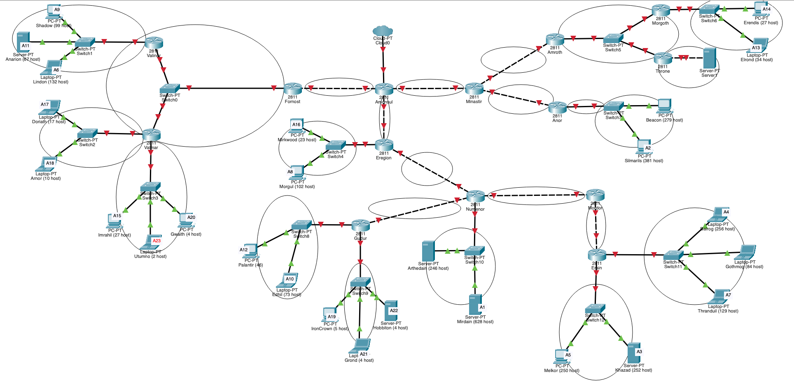
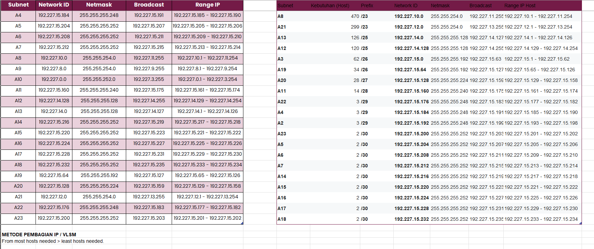
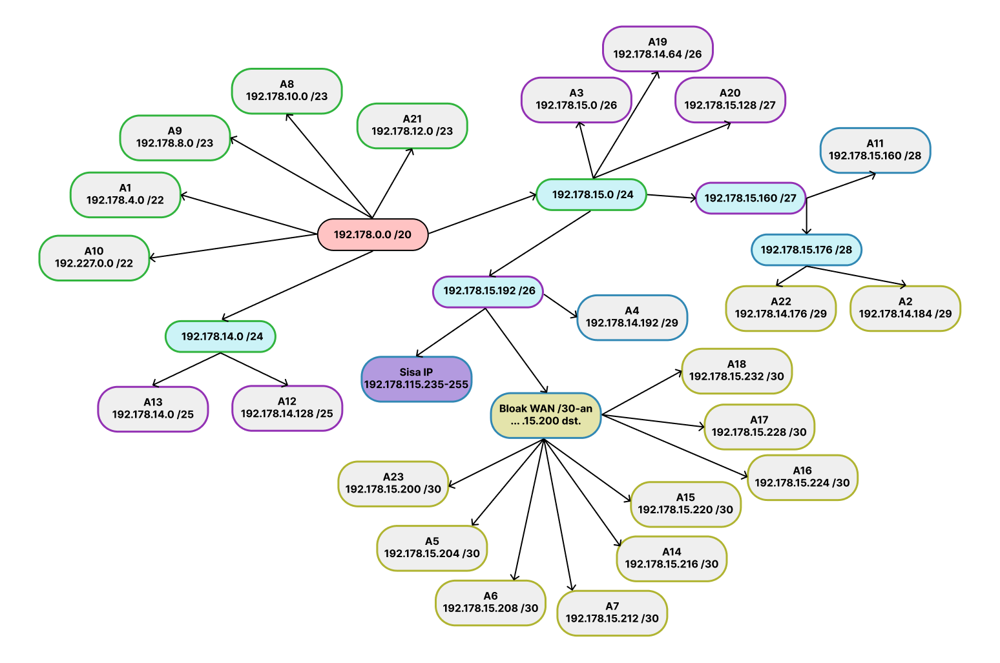
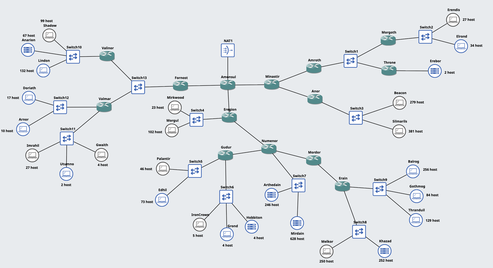

# Laporan Resmi Praktikum Modul 4 Jarkom

|No|Nama anggota|NRP|
|---|---|---|
|1. | Tasya Aulia Darmawan | 5027241009|
|2. | Ahmad Rafi F D | 5027241068|

## Cisco Packet Tracer - CIDR

## GNS3 - VLSM

Pada bagian ini, dilakukan pembagian IP menggunakan metode VLSM (Variable Length Subnet Mask) berdasarkan topologi dan kebutuhan host yang telah ditentukan.

### 1. Perhitungan Subnet (VLSM)

Berikut adalah tabel kebutuhan host untuk setiap subnet, diurutkan dari subnet dengan jaringan terbesar.

| Nama Subnet | Rute (Keterangan) | Jumlah Hubungan/Host | Netmask |
| :--- | :--- | :--- | :--- |
| A10 | Amonsul > Eregion > Numenor > Arthedain, Mirdain | 875 | /22 |
| A1 | Amonsul > MinasTir > Anor > Beacon, Silmarlis | 661 | /22 |
| A9 | Amonsul > Eregion > Numenor > Mordor > Erain > Melkor, Khazad | 503 | /23 |
| A8 | Amonsul > Eregion > Numenor > Mordor > Erain > Thranduil, Gothmog | 470 | /23 |
| A21 | Amonsul > Fornost > Valinor > Shadow, Anarion, Lindon | 299 | /23 |
| A13 | Amonsul > Eregion > Mirkwood, Morgul | 126 | /25 |
| A12 | Amonsul > Eregion > Numenor > Gudur > Palantir, Edhil | 120 | /25 |
| A3 | Amonsul > MinasTir > Amroth > Morgoth > Erendis, Elrond | 62 | /26 |
| A19 | Amonsul > Fornost > Valmar > Imrahil, Utumno, Gwaith | 34 | /26 |
| A20 | Amonsul > Fornost > Valinor > Doriath, Arnor | 28 | /27 |
| A11 | Amonsul > Eregion > Numenor > Gudur > IronCrown, Grond, Hobbiton | 14 | /28 |
| A22 | Amonsul > Fornost > Valinor, Valmar | 3 | /29 |
| A4 | Amonsul > MinasTir > Amroth > Morgoth, Throne | 3 | /29 |
| A2 | Amonsul > MinasTir > Amroth > Throne > Erebor | 3 | /29 |
| A23 | Amonsul > Fornost | 2 | /30 |
| A5 | Amonsul > MinasTir > Anor | 2 | /30 |
| A6 | Amonsul > MinasTir > Amroth | 2 | /30 |
| A7 | Amonsul > MinasTir | 2 | /30 |
| A14 | Amonsul > Eregion > Numenor > Mordor > Erain | 2 | /30 |
| A15 | Amonsul > Eregion > Numenor > Mordor | 2 | /30 |
| A16 | Amonsul > Eregion > Numenor > Gudur | 2 | /30 |
| A17 | Amonsul > Eregion > Numenor | 2 | /30 |
| A18 | Amonsul > Eregion | 2 | /30 |
| **Total** | | **3219** | **/20** |

### 2. Pembagian IP (Tree VLSM)

Berdasarkan perhitungan VLSM di atas dengan Network ID utama **192.227.0.0/20**, berikut adalah tabel alokasi IP Address.

| Subnet | Network ID | Netmask | Broadcast | Range IP Host |
| :---: | :--- | :--- | :--- | :--- |
| **A10** | 192.227.0.0 | 255.255.252.0 (/22) | 192.227.3.255 | 192.227.0.1 - 192.227.3.254 |
| **A1** | 192.227.4.0 | 255.255.252.0 (/22) | 192.227.7.255 | 192.227.4.1 - 192.227.7.254 |
| **A9** | 192.227.8.0 | 255.255.254.0 (/23) | 192.227.9.255 | 192.227.8.1 - 192.227.9.254 |
| **A8** | 192.227.10.0 | 255.255.254.0 (/23) | 192.227.11.255 | 192.227.10.1 - 192.227.11.254 |
| **A21** | 192.227.12.0 | 255.255.254.0 (/23) | 192.227.13.255 | 192.227.12.1 - 192.227.13.254 |
| **A13** | 192.227.14.0 | 255.255.255.128 (/25) | 192.227.14.127 | 192.227.14.1 - 192.227.14.126 |
| **A12** | 192.227.14.128 | 255.255.255.128 (/25) | 192.227.14.255 | 192.227.14.129 - 192.227.14.254 |
| **A3** | 192.227.15.0 | 255.255.255.192 (/26) | 192.227.15.63 | 192.227.15.1 - 192.227.15.62 |
| **A19** | 192.227.15.64 | 255.255.255.192 (/26) | 192.227.15.127 | 192.227.15.65 - 192.227.15.126 |
| **A20** | 192.227.15.128 | 255.255.255.224 (/27) | 192.227.15.159 | 192.227.15.129 - 192.227.15.158 |
| **A11** | 192.227.15.160 | 255.255.255.240 (/28) | 192.227.15.175 | 192.227.15.161 - 192.227.15.174 |
| **A22** | 192.227.15.176 | 255.255.255.248 (/29) | 192.227.15.183 | 192.227.15.177 - 192.227.15.182 |
| **A4** | 192.227.15.184 | 255.255.255.248 (/29) | 192.227.15.191 | 192.227.15.185 - 192.227.15.190 |
| **A2** | 192.227.15.192 | 255.255.255.248 (/29) | 192.227.15.198 | 192.227.15.193 - 192.227.15.198 |
| **A23** | 192.227.15.200 | 255.255.255.252 (/30) | 192.227.15.203 | 192.227.15.201 - 192.227.15.202 |
| **A5** | 192.227.15.204 | 255.255.255.252 (/30) | 192.227.15.207 | 192.227.15.205 - 192.227.15.206 |
| **A6** | 192.227.15.208 | 255.255.255.252 (/30) | 192.227.15.211 | 192.227.15.209 - 192.227.15.210 |
| **A7** | 192.227.15.212 | 255.255.255.252 (/30) | 192.227.15.215 | 192.227.15.213 - 192.227.15.214 |
| **A14** | 192.227.15.216 | 255.255.255.252 (/30) | 192.227.15.219 | 192.227.15.217 - 192.227.15.218 |
| **A15** | 192.227.15.220 | 255.255.255.252 (/30) | 192.227.15.223 | 192.227.15.221 - 192.227.15.222 |
| **A16** | 192.227.15.224 | 255.255.255.252 (/30) | 192.227.15.227 | 192.227.15.225 - 192.227.15.226 |
| **A17** | 192.227.15.228 | 255.255.255.252 (/30) | 192.227.15.231 | 192.227.15.229 - 192.227.15.230 |
| **A18** | 192.227.15.232 | 255.255.255.252 (/30) | 192.227.15.235 | 192.227.15.233 - 192.227.15.234 |

### 3. Konfigurasi Interface Router

Berikut adalah daftar konfigurasi IP Address untuk setiap interface router.

#### Router Amonsul

- `eth0`: NAT
- `eth1`: 192.227.15.213/30 (Link ke MinasTir [A7])
- `eth2`: 192.227.15.233/30 (Link ke Eregion [A18])
- `eth3`: 192.227.15.201/30 (Link ke Fornost [A23])

#### Router MinasTir

- `eth0`: 192.227.15.214/30 (Link ke Amonsul [A7])
- `eth1`: 192.227.15.209/30 (Link ke Amroth [A6])
- `eth2`: 192.227.15.205/30 (Link ke Anor [A5])

#### Router Anor

- `eth0`: 192.227.15.206/30 (Link ke MinasTir [A5])
- `eth1`: 192.227.4.1/22 (LAN Beacon, Silmarlis [A1])

#### Router Amroth

- `eth0`: 192.227.15.210/30 (Link ke MinasTir [A6])
- `eth1`: 192.227.15.185/29 (Link ke Morgoth & Throne [A4])
- `eth2`: 192.227.15.1/26 (LAN Morgoth > Erendis [A3])

#### Router Morgoth

- `eth0`: 192.227.15.186/29 (Link ke Amroth [A4])
- `eth1`: 192.227.15.2/26 (LAN Erendis, Elrond [A3])

#### Router Throne

- `eth0`: 192.227.15.187/29 (Link ke Amroth [A4])
- `eth1`: 192.227.15.193/29 (LAN Erebor [A2])

#### Router Eregion

- `eth0`: 192.227.15.234/30 (Link ke Amonsul [A18])
- `eth1`: 192.227.15.229/30 (Link ke Numenor [A17])
- `eth2`: 192.227.14.1/25 (LAN Mirkwood, Morgul [A13])

#### Router Numenor

- `eth0`: 192.227.15.230/30 (Link ke Eregion [A17])
- `eth1`: 192.227.15.221/30 (Link ke Mordor [A15])
- `eth2`: 192.227.15.225/30 (Link ke Gudur [A16])
- `eth3`: 192.227.0.1/22 (LAN Arthedain, Mirdain [A10])

#### Router Mordor

- `eth0`: 192.227.15.222/30 (Link ke Numenor [A15])
- `eth1`: 192.227.15.217/30 (Link ke Erain [A14])

#### Router Erain

- `eth0`: 192.227.15.218/30 (Link ke Mordor [A14])
- `eth1`: 192.227.10.1/23 (LAN Thranduil, Gothmog [A8])
- `eth2`: 192.227.8.1/23 (LAN Melkor, Khazad [A9])

#### Router Gudur

- `eth0`: 192.227.15.226/30 (Link ke Numenor [A16])
- `eth1`: 192.227.15.161/28 (LAN IronCrown, Grond [A11])
- `eth2`: 192.227.14.129/25 (LAN Palantir, Edhil [A12])

#### Router Fornost

- `eth0`: 192.227.15.202/30 (Link ke Amonsul [A23])
- `eth1`: 192.227.15.177/29 (Link ke Valinor & Valmar [A22])

#### Router Valmar

- `eth0`: 192.227.15.178/29 (Link ke Fornost [A22])
- `eth1`: 192.227.15.65/26 (LAN Imrahil, Utumno [A19])
- `eth2`: 192.227.15.129/27 (LAN Doriath, Arnor [A20])

#### Router Valinor

- `eth0`: 192.227.15.179/29 (Link ke Fornost [A22])
- `eth1`: 192.227.12.1/23 (LAN Shadow, Anarion [A21])

